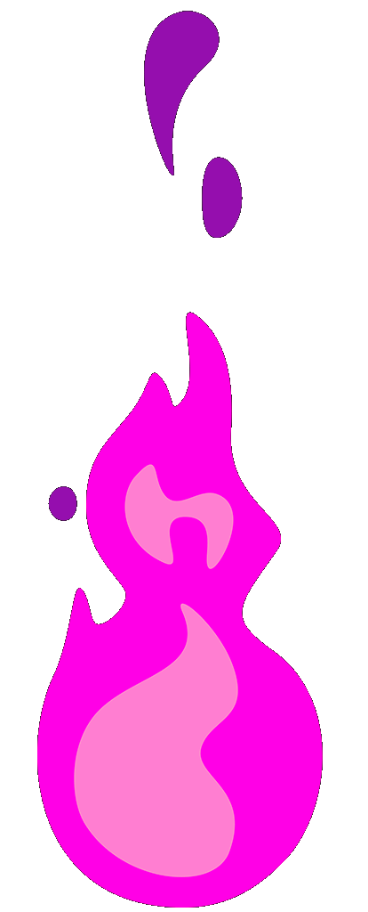

<!-- Header -->

  
  
  
  <!-- Description -->
  

  🚀 Hi there! I'm a final-year student passionate about all things technology 🌐. While I explore various tech fields, my current journey focuses on mastering Web Development 🖥️. I love crafting modern, responsive, and interactive web applications using tools like React, Laravel, and Tailwind CSS ⚡. My goal is to become a skilled full-stack developer while contributing to open-source projects 🤝. Outside of coding, you’ll find me exploring the latest tech trends or solving fun programming challenges 🎯. Let’s connect and build something amazing together! 💡
  

  

  
  

  <h2> 
     
    Self-taught and passionate about coding! 
     
  </h2>

<!-- List Tech -->

 
      
  <a href="https://github.com/MroyhanF" target="_blank">

  

  </a>

 
 

  
My Tech ⚡

  
  

  
Github Stats 📊

  
  

    
  
    
  

  
  
  
    

  

